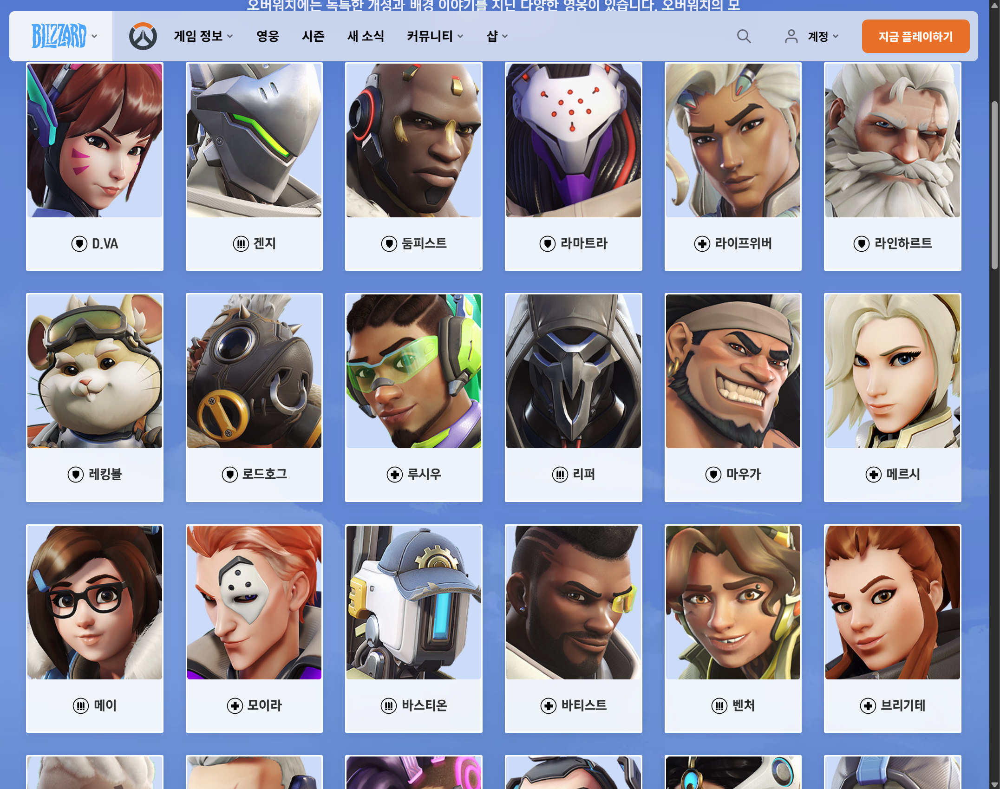
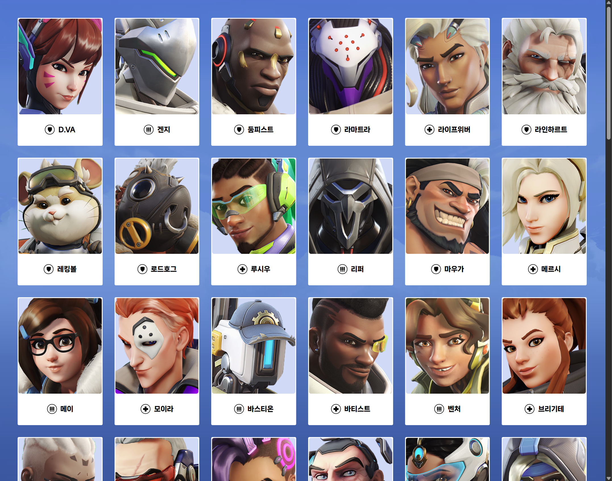

# Overwatch homepage

---

패스트캠퍼스 '시그니처 프론트엔드'강의에서 Overwatch 캐릭터 선택 예제를 보고

클론코딩은 나와 맞지 않아

실제 [Overwatch 홈페이지](https://overwatch.blizzard.com/ko-kr/heroes/)에 접속하면 볼 수 있는 영웅 페이지를

배웠던 부분을 활용하여 오로지 HTML + CSS로만 구현했다.

### 실제 홈페이지

### 구현한 화면

  

## 느낀점

전체적인 UI 레이아웃에 대해서 감을 잡기 시작했다.
FigJam을 사용해서 대략적인 큰 틀을 잡고 하나씩 구현해 나갔다.

 

## 다른 라이브러리 및 도구들을 사용하지 않고 Vanilla Code(only html + css)로 작성하다보니 처음에 잘못된 부분이 뒤늦게 발견되어 수정해야 할 부분들이 너무 많았다. (지옥의 crtl + c , crtl + v)

### problem) 잘못된 태그 사용

강의에서는 영웅들 사진을 쉽게 제어하기 위해 CSS의 background-image로 다루었다.

당연히 배운대로 background-image를 썻지만, img태그도 있다는 것을 뒤늦게 깨닫고

이 2가지의 차이점에 대해서 알아보았다.

| 구분      | \ 태그                       | background-image                             |
| --------- | ---------------------------------- | -------------------------------------------- |
| 핵심 기준 | 콘텐츠 (의미 있음)                 | 장식 (의미 없음)                             |
| 웹 접근성 | alt 속성으로 설명 가능 (매우 좋음) | 설명 불가 (나쁨)                             |
| SEO       | 검색엔진이 인지함 (좋음)           | 인지하지 못함 (나쁨)                         |
| 스타일링  | CSS 제어가 제한적                  | background-size 등 다양한 속성으로 제어 용이 |
| 인쇄      | 기본적으로 인쇄됨                  | 기본적으로 인쇄되지 않음                     |

 

실제 오버워치 개발자가 되어 홈페이지를 구현한다고 생각했을 때, img태그를 사용하는 것이 더 의미가 있고 웹 접근성 및 SEO도 좋다고 판단하여 뒤늦게 43개의 태그들을 다 바꿔주었다. 😂😂😂

구현 보다는 처음 설계부분이 가장 중요한 것 같다.

## 나무를 먼저 보지 말고 숲을 보는 것이 중요하다는 것을 느꼈다.

\+

겉모습은 정말 똑같이 만들었다고 생각한다. 디테일한 부분도 정말 잘했다.

하지만, 반응형 웹, 사용자와의 상호작용 등 아직 부족한 부분이 많이 있다.

추가적으로 공부해나가면서 실제 홈페이지와 똑같게 구현해나갈 것이다.

 

_첫 술에 배부르랴_
